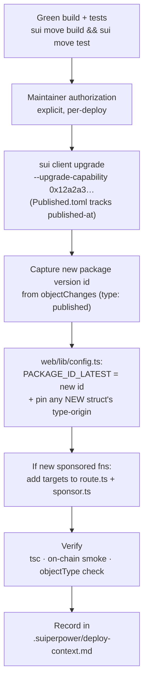

# Deploying & upgrading HostIt

How the on-chain `hostit_ticket` Move package is published and upgraded, and how to roll a deploy through to the frontend. This is for **maintainers with deploy access** — contributors should *not* deploy as part of a PR (see [Authorization](#authorization)).

> **Core principle:** after the initial publish, every on-chain change ships as a **package upgrade** (`sui client upgrade`), never a fresh re-publish. Upgrades **preserve all existing objects** (the shared `Hub`, `PoapRegistry`, every `Event`/`Ticket`/market). A fresh publish would orphan them.

## Why upgrades, not re-publishes

Sui anchors a **type's identity to the package version that introduced it**. So:

- Core modules (`event`, `ticket`, `market`, `hub`, `checkin`, `access`, `poap`, `forum`) keep the **original** package id.
- A struct added in a later upgrade (e.g. `predict::SelloutMarket`, `predict::RangeMarket`) lives at the **version that introduced it**.
- **Function calls** always target the **latest** version.

The frontend encodes this in `web/lib/config.ts`:

| Constant | Value (testnet) | Use |
|---|---|---|
| `PACKAGE_ID` | `0xd61c2a…dd48c3` (fresh v1) | type identity for core modules |
| `PREDICT_SELLOUT_PKG` | `0xd61c2a…dd48c3` (= v1) | `SelloutMarket` type/events |
| `PACKAGE_ID_LATEST` | `0xd61c2a…dd48c3` (= v1) | **all `predict` calls** + `RangeMarket` type/events |

> Fresh publish (2026-06-20): all pins equal `0xd61c2a…dd48c3` until the first in-place upgrade, which re-splits them (latest rolls forward, type origins stay).

`Published.toml` (Sui automated address management) is the **single source of truth** for `published-at` / `original-id` / `version` and the `UpgradeCap`. `Move.toml` no longer pins `published-at`.

## Prerequisites

- The [Sui CLI](https://docs.sui.io/references/cli) on the target env (`sui client active-env` → `testnet`).
- The deployer address holds the package **`UpgradeCap`** `0x12a2a3c5…ec22bf` and enough gas (`sui client gas`).
- A green tree: `sui move build` and `sui move test` both pass.
- Upgrades must be **compatibility-safe**: you may *add* modules, structs, and public functions, but you may **not** change existing struct layouts or public function signatures incompatibly. `sui client upgrade` enforces this.

## Upgrade procedure



1. **Build + test** from the repo root:
   ```bash
   sui move build && sui move test
   ```
2. **Upgrade** (from the repo root). With automated address management, `Published.toml` supplies `published-at`; pass the cap explicitly:
   ```bash
   sui client upgrade --upgrade-capability 0x12a2a3c5fa6dd53de253dc1327d3aaaba08839e8e86b6e0a188dc19c45ec22bf \
     --gas-budget 2000000000 --json > /tmp/upgrade.json
   ```
3. **Capture the new package version id** — the `objectChanges` entry with `"type":"published"` → `packageId`. (Also note the digest and that the `UpgradeCap` version bumped.)
4. **Roll the frontend** in `web/lib/config.ts`:
   - Set `PACKAGE_ID_LATEST` to the new id (or override via `NEXT_PUBLIC_HOSTIT_PACKAGE_LATEST_ID`).
   - If the upgrade **introduced a new struct/event**, add a pinned type-origin constant for it (like `PREDICT_SELLOUT_PKG`) and point that type's `*_TYPE`/`EV_*` constants at it. Existing types' constants stay put.
5. **Allowlist new sponsored functions** — if you added gas-sponsored entry functions, add their targets to **both** `web/app/api/sponsor/route.ts` (authoritative) and `web/lib/sponsor.ts` (client hint), using the correct package id.
6. **Verify** (this is mandatory — the type-origin rule is easy to get wrong):
   - `bunx tsc --noEmit` in `web/`.
   - **On-chain smoke:** create one object touching the new code (e.g. via `sui client call`) and confirm its reported `objectType` matches the constants you wired — don't assume the version.
   - Browser-check the affected screen.
7. **Record the deploy** by appending an entry to `.suiperpower/deploy-context.md` (package id, upgrade tx digest, `UpgradeCap` version, what changed, on-chain smoke result).

## Verifying the type-origin wiring

The most common upgrade bug is a frontend constant pointing at the wrong package version, which silently makes queries return nothing. After deploying, confirm a freshly created object's on-chain `objectType` exactly matches the `*_TYPE` constant the UI filters on. For example, a `predict::RangeMarket` created after v3 reports `0xb5c952…::predict::RangeMarket<…>` — so `RANGE_MARKET_TYPE` must use `PACKAGE_ID_LATEST`, **not** the original `PACKAGE_ID`.

## Authorization

- **On-chain upgrades are maintainer-only and require explicit, per-deploy approval.** They are irreversible and cost gas. Do not run `sui client upgrade`/`publish` as part of a routine PR.
- A PR may include the *code* for an upgrade (new module, frontend wiring behind the env-overridable constants), but the actual chain deploy + the `PACKAGE_ID_LATEST` bump happens as a separate, authorized step by a maintainer.

## Mainnet considerations

Before promoting to mainnet:
- Pin the `Sui` framework dependency in `Move.toml` to a specific commit SHA (currently `rev = "framework/testnet"`).
- Transfer the `UpgradeCap` to a multisig (it's a single EOA on testnet).
- Re-publish to mainnet (a distinct package id) and point the frontend env vars at the mainnet ids + mainnet USDC coin type.
- Update the Enoki gas pool / allowlist for mainnet.

---

See also: [`README`](./README.md) (architecture + deployed ids), [`CONTRIBUTING`](./CONTRIBUTING.md) (dev workflow), [`CLAUDE.md`](./CLAUDE.md) (full package-versioning model).
