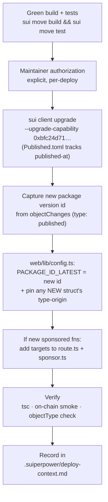

# Deploying & upgrading HostIt

How the on-chain `hostit_ticket` Move package is published and upgraded, and how to roll a deploy through to the frontend. This is for **maintainers with deploy access** — contributors should *not* deploy as part of a PR (see [Authorization](#authorization)).

> **Core principle:** every *additive* on-chain change ships as a **package upgrade** (`sui client upgrade`). Upgrades **preserve all existing objects** (the shared `Hub`, `PoapRegistry`, `TransferPolicy<Ticket>`, every `Event`/`Ticket`/market); a fresh publish orphans them. Fresh-publish only when an upgrade genuinely can't carry the change — see [Upgrade vs fresh publish](#upgrade-vs-fresh-publish--choosing).

## Why upgrades, not re-publishes

Sui anchors a **type's identity to the package version that introduced it**. So:

- Core modules (`event`, `ticket`, `market`, `hub`, `checkin`, `access`, `poap`, `forum`) keep the **original** package id.
- A struct added in a later upgrade (e.g. `predict::SelloutMarket`, `predict::RangeMarket`) lives at the **version that introduced it**.
- **Function calls** always target the **latest** version.

The frontend encodes this in `web/lib/config.ts`:

| Constant | Value (testnet) | Use |
|---|---|---|
| `PACKAGE_ID` | `0x6a41303d…671fcd` (fresh v1) | type identity for core modules |
| `PREDICT_SELLOUT_PKG` | `0x6a41303d…671fcd` (= v1) | `SelloutMarket` type/events |
| `PACKAGE_ID_LATEST` | `0x6a41303d…671fcd` (= v1) | **all `predict` calls** + `RangeMarket` type/events |

> Fresh publish (2026-06-20): all pins equal `0x6a41303d…671fcd` until the first in-place upgrade, which re-splits them (latest rolls forward, type origins stay).

`Published.toml` (Sui automated address management) is the **single source of truth** for `published-at` / `original-id` / `version` and the `UpgradeCap`. `Move.toml` no longer pins `published-at`.

## Upgrade vs fresh publish — choosing

Default to **upgrade**. A fresh publish is only forced in two cases:

1. **Incompatible Move change** — changing an existing struct's fields/abilities or a public function's signature. `sui client upgrade` rejects these. (e.g. the predict `settle_after_ms` reshape that forced the `0xd61c2a` republish.)
2. **Changing the *behavior* of an existing function the frontend calls via `PACKAGE_ID` (`target()`).** An upgrade adds a new version, but `PACKAGE_ID::mod::fn` still runs the **old** bytecode — only `PACKAGE_ID_LATEST::mod::fn` runs the new code. So relaxing e.g. `event::create_event`'s asserts won't take effect on an upgrade unless that call is also repointed to `targetLatest`. (This is why #39's relaxed asserts shipped as the `0x80ffb7c9` republish.)

Everything else — **new** functions/structs/modules, with new functions called via `targetLatest` — upgrades cleanly and preserves all state. (#37's forum organizer-admin is this case: `post_as_organizer`/`moderate`/`PostModerated` are new and called via `PACKAGE_ID_LATEST`; `forum::post` is unchanged at `PACKAGE_ID`.)

> **Strategy for "many changes coming":** route call targets for any function whose *behavior* may change through `targetLatest`, not `target()`. Type identities stay pinned (`PACKAGE_ID` + origin pins); only the call sites follow latest. Then upgrades take effect without rewiring, and case 2 above stops forcing republishes — leaving fresh-publish only for genuinely incompatible schema changes. On **mainnet a fresh publish is never acceptable** (it strands users' tickets/events), so the upgrade path must be solid before launch.

## If `sui client upgrade` hangs or fails

Upgrades have succeeded here (v6/v7/v8). The failures were environmental, not the protocol:

- **Wrong CLI binary.** Homebrew `sui` 1.73.0 could not upgrade once testnet advanced to protocol 126 (`binary max 125`). Use the 1.73.1 binary at `~/.local/bin/sui` — verify with `which sui` + `sui --version` **before** deploying.
- **RPC transport.** The CLI uses the **gRPC** fullnode API. Keep `sui client active-env` on a gRPC endpoint (`testnet` → `fullnode.testnet.sui.io:443`). Third-party **JSON-RPC** gateways (e.g. Tatum) do **not** work for the CLI (`invalid compression flag` = an HTML/JSON error page where a gRPC frame was expected).
- **Execute/wait hang.** Decouple building from submitting so a stalled node can't wedge it:
  ```bash
  sui client upgrade --upgrade-capability 0xbfc24d71…f5de3 \
    --gas-budget 2000000000 --serialize-unsigned-transaction > /tmp/upgrade.txt
  # sign + execute the bytes separately (retryable); retry on 429
  ```

## Prerequisites

- The [Sui CLI](https://docs.sui.io/references/cli) on the target env (`sui client active-env` → `testnet`).
- The deployer address holds the package **`UpgradeCap`** `0xbfc24d71…f5de3` and enough gas (`sui client gas`).
- A green tree: `sui move build` and `sui move test` both pass.
- Upgrades must be **compatibility-safe**: you may *add* modules, structs, and public functions, but you may **not** change existing struct layouts or public function signatures incompatibly. `sui client upgrade` enforces this.

## Upgrade procedure



1. **Build + test** from the repo root:
   ```bash
   sui move build && sui move test
   ```
2. **Upgrade** (from the repo root). With automated address management, `Published.toml` supplies `published-at`; pass the cap explicitly:
   ```bash
   sui client upgrade --upgrade-capability 0xbfc24d71ba8b3f5285e83ee24afa941f7f2726fe9aafccc260734c3dba4f5de3 \
     --gas-budget 2000000000 --json > /tmp/upgrade.json
   ```
3. **Capture the new package version id** — the `objectChanges` entry with `"type":"published"` → `packageId`. (Also note the digest and that the `UpgradeCap` version bumped.)
4. **Roll the frontend** in `web/lib/config.ts`:
   - Set `PACKAGE_ID_LATEST` to the new id (or override via `NEXT_PUBLIC_HOSTIT_PACKAGE_LATEST_ID`).
   - If the upgrade **introduced a new struct/event**, add a pinned type-origin constant for it (like `PREDICT_SELLOUT_PKG`) and point that type's `*_TYPE`/`EV_*` constants at it. Existing types' constants stay put.
5. **Allowlist new sponsored functions** — if you added gas-sponsored entry functions, add their targets to **both** `web/app/api/sponsor/route.ts` (authoritative) and `web/lib/sponsor.ts` (client hint), using the correct package id.
6. **Verify** (this is mandatory — the type-origin rule is easy to get wrong):
   - `bunx tsc --noEmit` in `web/`.
   - **On-chain smoke:** create one object touching the new code (e.g. via `sui client call`) and confirm its reported `objectType` matches the constants you wired — don't assume the version.
   - Browser-check the affected screen.
7. **Record the deploy** by appending an entry to `.suiperpower/deploy-context.md` (package id, upgrade tx digest, `UpgradeCap` version, what changed, on-chain smoke result).

## Fresh-publish procedure (only when forced)

When an upgrade can't carry the change (see [the two cases above](#upgrade-vs-fresh-publish--choosing)). A fresh publish gives the package a **new id**, re-runs the module initializers, and **orphans all prior on-chain state** (old `Event`/`Ticket`/market/forum objects and their event logs stop resolving under the new package type) — acceptable on testnet, **never on mainnet**.

1. **Authorized publish** (gated), from the repo root on the 1.73.1 binary + a gRPC env:
   ```bash
   sui client publish --gas-budget 2000000000 --json > /tmp/publish.json
   ```
2. **Capture from `objectChanges`** — the module initializers (`hub::init`, `poap::init`) auto-create and share everything; no manual setup call is needed:
   - the published `packageId` (type `published`);
   - shared **`Hub`**, **`PoapRegistry`**, **`TransferPolicy<…::ticket::Ticket>`**;
   - the new **`UpgradeCap`**, **`PlatformCap`**, **`TransferPolicyCap<Ticket>`** (owned by the deployer).
3. **Roll `web/lib/config.ts`** — fresh v1, so all four package pins collapse to the new id:
   - `PACKAGE_ID`, `PACKAGE_ID_LATEST`, `PREDICT_SELLOUT_PKG`, `PREDICT_RANGE_PKG` → new id;
   - `HUB_ID`, `POAP_REGISTRY_ID`, `TRANSFER_POLICY_ID` → the new shared-object ids.
4. **`Move.toml`** `[addresses] hostit_ticket` → new id; **`Published.toml`** is rewritten by the publish.
5. **Env diff (Vercel):** `NEXT_PUBLIC_HOSTIT_PACKAGE_ID` (+ any `*_LATEST_ID`/object-id overrides) → new ids; redeploy. `SPONSORED_TARGETS` derive from `config.ts`, so the Enoki allowlist updates on the next server deploy automatically.
6. **Re-attach** any `TransferPolicy<Ticket>` rules if resale is live (`policy_rules::setup_ticket_policy`).
7. **Verify** (`tsc` + on-chain smoke + `objectType` check) and **record** in `.suiperpower/deploy-context.md`.

## Verifying the type-origin wiring

The most common upgrade bug is a frontend constant pointing at the wrong package version, which silently makes queries return nothing. After deploying, confirm a freshly created object's on-chain `objectType` exactly matches the `*_TYPE` constant the UI filters on. Today (fresh v1) every type origin equals `0x6a41303d…671fcd`, so a `predict::RangeMarket` reports `0x6a41303d…::predict::RangeMarket<…>`. After the first in-place upgrade, newly created objects of an upgrade-introduced struct report the **new** package id — so that struct's `*_TYPE` must use `PACKAGE_ID_LATEST` (or its own pinned origin), **not** the original `PACKAGE_ID`.

## Authorization

- **On-chain upgrades are maintainer-only and require explicit, per-deploy approval.** They are irreversible and cost gas. Do not run `sui client upgrade`/`publish` as part of a routine PR.
- A PR may include the *code* for an upgrade (new module, frontend wiring behind the env-overridable constants), but the actual chain deploy + the `PACKAGE_ID_LATEST` bump happens as a separate, authorized step by a maintainer.

## Mainnet considerations

Before promoting to mainnet:
- Pin the `Sui` framework dependency in `Move.toml` to a specific commit SHA (currently `rev = "framework/testnet"`).
- Transfer the `UpgradeCap` to a multisig (it's a single EOA on testnet).
- Re-publish to mainnet (a distinct package id) and point the frontend env vars at the mainnet ids + mainnet USDC coin type.
- Update the Enoki gas pool / allowlist for mainnet.

---

See also: [`README`](./README.md) (architecture + deployed ids), [`CONTRIBUTING`](./CONTRIBUTING.md) (dev workflow), [`CLAUDE.md`](./CLAUDE.md) (full package-versioning model).
