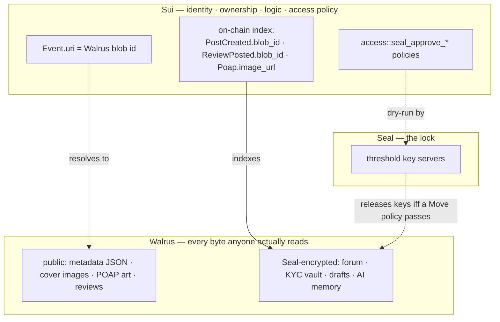
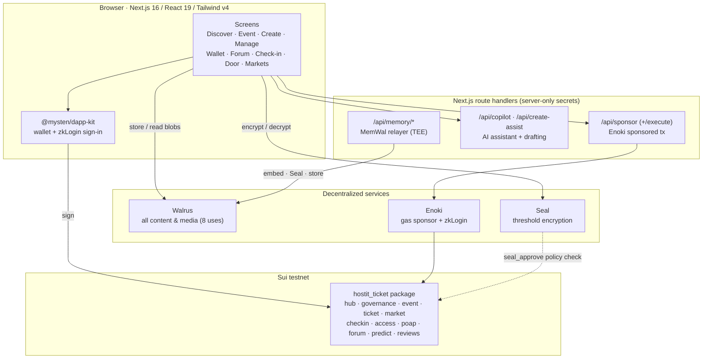
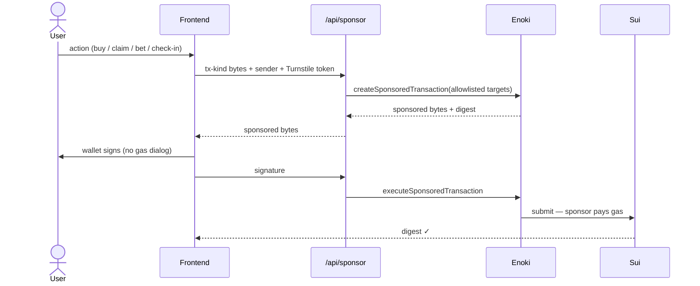
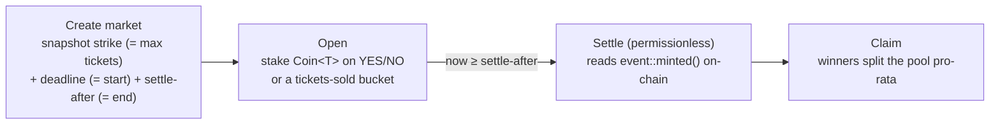
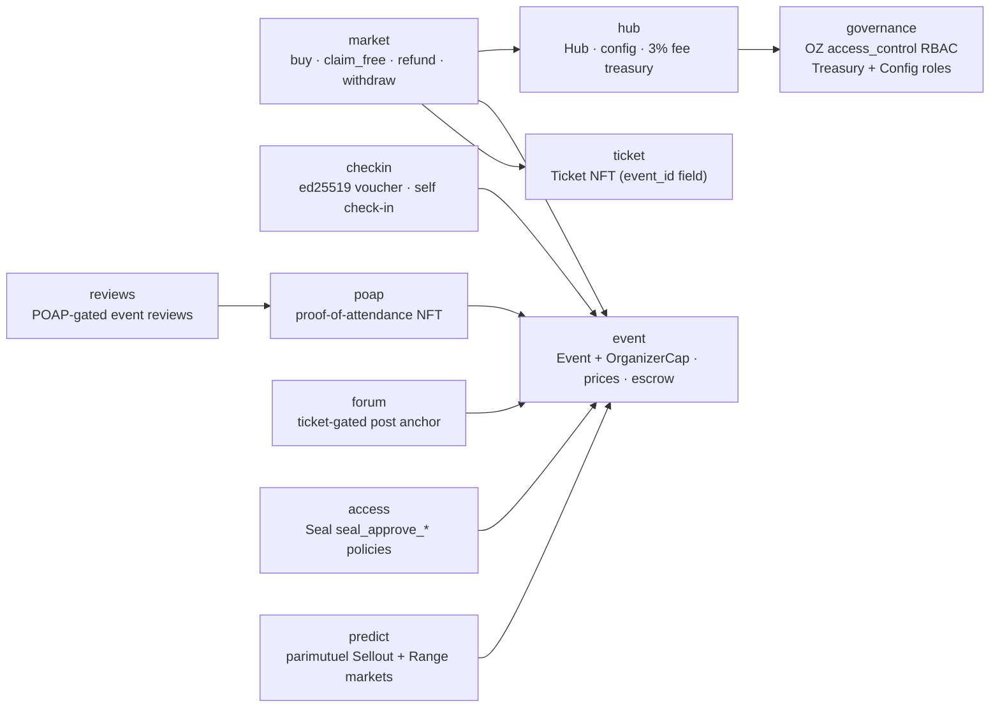

<div align="center">

<picture>
  <source media="(prefers-color-scheme: dark)" srcset="https://hostit-sui.vercel.app/brand/logo-white.png">
  
</picture>

### Sell out, pay out, and bet on it — on-chain.

**Permissionless event ticketing on [Sui](https://sui.io).** Any wallet can host. Tickets sell in any coin, gasless. Payouts withdraw straight from on-chain escrow — no platform skim, no takedowns. Then a parimutuel market settles itself on the final count: no oracle, no house.

[**▶ Live demo — hostit-sui.vercel.app**](https://hostit-sui.vercel.app) · [Move package](#deploy) · [Built for the Walrus track](#walrus)

[](https://hostit-sui.vercel.app)
[](#walrus)
[](#seal)
[](#features)
[](#move)
[](#license)

</div>

---

## What is HostIt?

Running an event today means stitching together five tools that never talk — a ticketer, a payment processor, a check-in app, an email blaster, and a spreadsheet. The ticketer is **custodial** (it holds your money), **gatekept** (you apply for permission to sell), and **closed** (nothing programmable can live on top of an event).

HostIt collapses that into one on-chain platform:

| The old way | The HostIt way |
|---|---|
| Five disconnected tools | One platform, on-chain |
| Apply for permission to sell | **Any wallet hosts** — no gatekeeper, no takedowns |
| Platform holds the money | **Payouts withdraw from on-chain escrow** |
| Buyers need a wallet + gas | **Gasless** checkout & check-in (sign in with Google) |
| No engagement layer | **Native prediction markets** + an encrypted ticket-holder forum |
| Your data on their servers | **Walrus** holds the content, **Seal** holds the keys, **Sui** holds the truth |

> HostIt is a faithful Sui Move port of the HostIt EVM Diamond — the same brand and crew that welcomed **~50K attendees across 6 flagship events** (Web3Lagos, Borderless, Anambra Web3, and more) — rebuilt **Walrus-native** for Sui. *Proven on EVM, now native on Sui.*

---

<a id="walrus"></a>

## ✨ Why Walrus: the content layer of a real product

> **This is the heart of the Walrus track submission.** HostIt doesn't store one image on Walrus and call it decentralized. **Walrus is the entire content backend of a full consumer app** — public metadata, media, *and* Seal-encrypted private data — across **eight distinct use cases**, on a single **49-line** SDK-free HTTP client. There is **no content database anywhere**: the Sui event log is the index, Walrus is the store.

### Walrus is load-bearing, and the contract proves it

An on-chain `Event` is deliberately *thin* — name, times, caps, flags — plus one field: `uri: String`, which is **nothing but a Walrus blob id**. And the Move code **refuses to mint an event whose `uri` is empty**:

```move
// sources/event.move
assert!(string::length(&uri) > 0, E_EMPTY_URI);   // every Event MUST point at a Walrus blob
```

So a HostIt event that doesn't live on Walrus *cannot exist*. Sui state is structurally incomplete without Walrus — provable in one `assert`, not a marketing claim.

### The three-layer split — verifiable by file



**Sui owns identity, ownership, logic and access policy. Walrus owns content and media. Seal owns the lock on the private subset.** Every anchor is concrete and greppable.

### Eight Walrus use cases, one tiny HTTP client

`web/lib/walrus.ts` is the whole client: `PUT ${publisher}/v1/blobs?epochs=N` to write, `GET ${aggregator}/v1/blobs/{id}` to read — no SDK, with Walrus dedup (`newlyCreated` vs `alreadyCertified`) handled and `blobUrl()` exposed so a cover image is just an `` pointed at the aggregator.

| # | Use case | What's stored | Encrypted? | On-chain anchor |
|---|---|---|:--:|---|
| 1 | **Event metadata** | description, category, venue, city, tiers, flags (JSON) | — | `Event.uri` *(required, non-empty)* |
| 2 | **Cover images** | raw image bytes, served straight from the aggregator | — | `coverBlobId` inside the metadata blob |
| 3 | **POAP artwork** | the event's Walrus id, cloned into the NFT | — | `Poap.image_url` via Sui **Display** |
| 4 | **Ticket-gated forum** | each message `{text,author,ts}`, one blob per post | 🔒 **Seal** | `PostCreated.blob_id` |
| 5 | **Public reviews** | rating + comment, POAP-gated (proves attendance) | — | `ReviewPosted.blob_id` |
| 6 | **KYC / identity vault** | organizer legal name + id | 🔒 **Seal (self)** | localStorage pointer; policy on-chain |
| 7 | **Event drafts** | full in-progress create form, 30-epoch TTL | 🔒 **Seal (self)** | localStorage index; no backend |
| 8 | **AI organizer memory** | embedded "memories" grounding AI drafts | 🔒 **Seal (TEE relayer)** | MemWal account |

### What sets this integration apart

- **Load-bearing, not decorative** — the contract `assert`s a non-empty Walrus `uri` (`event.move`). No Walrus, no event.
- **Breadth few can match** — 8 genuinely different uses (public metadata, media, NFT art, reviews, encrypted forum, encrypted KYC, encrypted drafts, TEE-relayed AI memory) on one 49-line client.
- **Walrus + Seal compose through *on-chain* policy** — a single forum ciphertext on Walrus is decryptable by **either** a `Ticket` (`seal_approve_ticket`) **or** the `OrganizerCap` (`seal_approve_organizer`) — same blob, two Move policies. Content stays single-copy; authorization is enforced by our package.
- **No content database, no websocket — anywhere.** The forum and reviews run on nothing but the Sui event log (the index) and Walrus (the store); the only server routes are stateless gas-sponsorship and AI helpers that persist no content. **Walrus *is* the content backend.**
- **Immutability done right** — forum moderation is by **tombstone** (`PostModerated` keyed on the Walrus blob id), never deletion, because a post is an immutable event + an immutable blob. The design embraces Walrus's permanence instead of fighting it.
- **Production polish** — TTL is first-class (`WALRUS_EPOCHS=10` vs `WALRUS_DRAFT_EPOCHS=30` for longer-lived drafts), dedup is handled, uploads are cached to avoid re-storing on retry, and both Walrus origins are pinned in the CSP.

---

## Features

- 🎟️ **Permissionless hosting** — connect a wallet (or sign in with Google) and publish the same afternoon. `create_event` shares an `Event` and hands you an `OrganizerCap{event_id}`; `create_event_with_price<T>` does create-and-price atomically so a paid event is never left un-buyable. No application, no gatekeeper, no takedowns.
- ⛽ **Gasless tickets & gasless check-in** — buyers and attendees never touch a faucet. Writes route through Enoki **server-side** sponsorship (`/api/sponsor` holds the private key; the user only signs), scoped by a single `SPONSORED_TARGETS` allowlist.
- 💸 **Any coin, escrow-backed payouts** — sell in SUI, USDC, or any `Coin<T>`. Sales split a flat **3% fee** into the Hub treasury and the rest into per-event escrow; organizers `withdraw_event_balance` directly. *No custodian, no skim beyond 3%, gas on us.*
- 🎲 **Native parimutuel prediction markets** — every event opens a **Sellout Clock** (will it sell out?) and a **final-tickets-sold range** market. They **settle trustlessly with no oracle** by reading the contract's own `event::minted()`. *Impossible on a Web2 ticketing platform.*
- ✅ **Attendee-signed check-in + live door** — staff sign an **ed25519 voucher** over `event_id ‖ ticket_id ‖ expiry`; the attendee submits one gasless tx. A full-screen Door view does QR scanning with a per-device key; live admit count refreshes in real time. Optional self-check-in; multi-day supported.
- 🏅 **POAP collectibles** — every check-in mints a proof-of-attendance NFT (once per ticket), its artwork rendered from Walrus through Sui Display.
- 🔒 **Ticket-gated, end-to-end encrypted forum** — a private per-event space (lineup chatter, ride-shares, the market) that non-holders **can't read**: Seal-encrypted, stored on Walrus, anchored on-chain.
- 📊 **Organizer dashboard** — live sales, attendees, check-ins, gross revenue and gross-by-coin across all your events; full cap-gated editing after launch.
- 🔑 **Passwordless, non-custodial sign-in** — Google via Enoki zkLogin (full-page redirect, no popup) *or* any Sui wallet. *Your keys, your tickets.*

---

## Architecture



### Gasless transaction flow

Sponsorship is **server-side** (the private Enoki key never reaches the browser); the user signs but pays no gas. A **Cloudflare Turnstile** bot-wall and a durable rate-limiter protect the sponsor edge.



---

<a id="seal"></a>

## 🔐 Seal + Walrus: private decentralized storage

The encrypted use cases (#4, #6, #7, #8 above) share one pattern: **encrypt client-side with Seal → store the ciphertext on Walrus → let an on-chain Move policy decide who can decrypt.** The aggregator only ever sees ciphertext; authorization lives on Sui.

Three `seal_approve_*` policies in `sources/access.move` are **dry-run by Seal's key servers** before any key share is released:

| Policy | Who passes | Gates |
|---|---|---|
| `seal_approve_ticket` | any holder of a `Ticket` for the event | the ticket-gated **forum** & shared content |
| `seal_approve_organizer` | the `OrganizerCap` holder | reads shared forum content; reserved for organizer-only data via the `hostit-org:` namespace |
| `seal_approve_self` | the data owner's own address | **KYC vault** and private **drafts** |

The forum is the headline pairing: `encryptForumMessage` Seal-encrypts the body against the event id, stores `{id, ct}` on Walrus, and anchors the blob id via `forum::post`. Decryption runs `approveTicket` **or** `approveOrganizer` over the **same** ciphertext — access control composes on-chain while content stays single-copy on Walrus. *(Seal config targets the testnet V2 committee key server with `verifyKeyServers` on everywhere except localnet.)*

---

## 🎲 Prediction markets — the engineering centerpiece

DeepBook Predict has no self-serve oracle on testnet, so HostIt ships its **own** parimutuel module that settles trustlessly against the event's verifiable on-chain mint counter — **no oracle, no keeper, no house, no fee.**



- **`SelloutMarket<T>`** — binary "will it sell out?": YES iff `minted >= strike` (strike snapshotted from `max_tickets` at creation).
- **`RangeMarket<T>`** — partitions the final count into N+1 mutually-exclusive buckets via a strictly-increasing cutoffs vector; exactly one wins.
- **Trustless settlement** — `settle()` asserts the snapshotted event id, requires `now ≥ end`, reads `minted()`, and pays out. Anyone can settle; there is no privileged settler.
- **Goalposts can't move** — strike, betting deadline, and settle time are snapshotted at creation, so a later `update_max_tickets`/`update_times` can't change an open market.
- **Funds never lock** — winners split the losing pool pro-rata; a documented *last-winner* branch drains rounding dust so pools reach exactly zero; a *no-winner* branch refunds every stake. Double-claims abort (stake is removed before payout); zero bets are rejected.

---

<a id="move"></a>

## 🧱 The Move package

One package, `hostit_ticket`, ported faithfully from the **HostIt EVM Diamond**. The Diamond's facets become focused modules; its global storage becomes Sui objects. **Hybrid access control:** per-event admin is a *capability* (`OrganizerCap{event_id}`); protocol governance is *RBAC* (OpenZeppelin `access_control`). Millisecond timestamps throughout.



| Module | Responsibility |
|---|---|
| `hub` | Shared `Hub`: protocol config + per-coin `Balance<T>` platform-fee treasury (3%). Touched by every paid sale; treasury/config setters gated on `governance` roles. |
| `governance` | Protocol RBAC via OpenZeppelin `access_control`: shared `AccessControl<GOVERNANCE>` with `TreasuryRole` + `ConfigAdminRole` and a timelocked root-admin handoff. Replaces the old single `PlatformCap`. |
| `event` | One shared `Event` per event (was a per-event ERC721 clone) + an `OrganizerCap{event_id}`; per-coin price/escrow via dynamic fields; revocable ed25519 signer set. |
| `ticket` | One global `Ticket` type whose per-event identity is an `event_id` field (Move types are static); rendered by a single `Display<Ticket>`. |
| `market` | Generic `Coin<T>` sales, the 3% fee split, escrow, time-locked withdrawals, and non-refundable-fee refunds. `u128` math with an overflow guard. |
| `checkin` | Attendee-signed check-in gated by a staff-signed **ed25519 voucher**, verified on-chain against a registered signer set; `self_check_in` fallback. |
| `access` | `seal_approve_ticket` / `seal_approve_organizer` / `seal_approve_self` decryption policies (dry-run by Seal). |
| `poap` | Proof-of-attendance NFT via a shared `PoapRegistry`, claimable after check-in (one per ticket); artwork from Walrus via Display. |
| `forum` | On-chain anchor (`PostCreated`) for ticket-gated Walrus + Seal messages; moderation by tombstone. |
| `predict` | Native parimutuel `SelloutMarket<T>` + `RangeMarket<T>` settling on `event::minted()`. |
| `reviews` | On-chain event reviews, **gated by a POAP** that proves the reviewer attended. |

**EVM → Sui mapping:** the Diamond owner + global fee accounting + ticketId counter → the shared `Hub`; `onlyOwner` → OZ roles in `governance`; each cloned per-event ERC721 → one shared `Event` + `OrganizerCap`; the per-event token → one global `Ticket`; `MarketplaceFacet`'s `FeeType` enum → the `Coin<T>` type parameter; `CheckInFacet`'s global `_used[tokenId]` flag (impossible against an *owned* Ticket) → the attendee-signed ed25519 voucher.

---

## 🛡️ Security

A layered posture spanning on-chain and the off-chain edge:

- **On-chain ed25519 check-in vouchers** — staff sign `event_id(32) ‖ ticket_id(32) ‖ expiry_ms(8 LE)`; verified on-chain against the Event's registered signer set with window + expiry checks. The degenerate all-zero pubkey is rejected; a test seam pins the exact byte layout against the web staff-key code so endianness drift fails a *test*, not a door.
- **Cloudflare Turnstile bot-wall** — the project-funded surface (gasless sponsor + AI routes) requires a single-use Turnstile token validated server-side; enforced only when the secret is set, fail-open on a Cloudflare outage.
- **Durable cross-instance rate-limit + replay nonce** — a per-process fixed-window counter with a write-through to shared KV (Vercel KV / Upstash) converges fan-out bursts to a global limit; signed auth envelopes carry a single-use, KV-backed replay nonce bound to a ~5-min window.
- **Server-only secrets + sponsor allowlist** — `ENOKI_PRIVATE_API_KEY` / `TURNSTILE_SECRET_KEY` / `GROQ_API_KEY` are never `NEXT_PUBLIC_`-prefixed; Enoki is passed a single exported `SPONSORED_TARGETS` allowlist as `allowedMoveCallTargets`.
- **Strict CSP + headers** — scoped `script-src`/`connect-src`, `frame-ancestors 'none'`, HSTS, nosniff; `buildCsp` is unit-tested.
- **On-chain economic safety** — `u128` fee math with a `U64_MAX` overflow guard; a non-refundable fee surfaced as `fee_forfeited`; prediction-market goalpost snapshotting; double-claim and pool-drain guarantees.
- **Capped enumeration** — event-log discovery is bounded (≤ 20 pages / ~1000 logs) and id batches respect the 50-id RPC cap.

---

## 🧰 Tech stack

- **Move 2024** (`hostit_ticket`) on Sui · `sui` CLI for build/test/upgrade.
- **Next.js 16** (App Router) · **React 19** · **Tailwind v4** · shadcn/Radix · Motion.
- `@mysten/sui` v2 · `@mysten/dapp-kit` v2 · `@mysten/enoki` · `@mysten/seal` · `@mysten-incubation/memwal` · `@tanstack/react-query`.
- **Walrus** (HTTP publisher/aggregator) · **Seal** (V2 committee key server) · **Enoki** (sponsored tx + zkLogin) · **Cloudflare Turnstile** · **Upstash Redis** · in-app AI copilot.
- Package manager: **bun** (only).

---

<a id="deploy"></a>

## 📦 On-chain deployment

Live on **Sui testnet** at **[hostit-sui.vercel.app](https://hostit-sui.vercel.app)**. `web/lib/config.ts` is the source of truth (all values are env-overridable).

| Object | ID |
|---|---|
| Package (fresh v1 — original == latest; all calls + type origins) | `0x7816f65c8fb05298df91fe25065b82ada0f61d8020d5673376ad02ecefcd314c` |
| Shared `Hub` | `0x9468930839c11fdad73e739a4052d1fe9367bd8ea98dd3f7198bade074138514` |
| Shared `PoapRegistry` | `0x5f234a6fbf1a3cb46595f51a437b45328c3f574255b70fab70029a4c6eaa5001` |
| Shared `TransferPolicy<Ticket>` | `0xb6e6f12c669175ded687cbccb559ec32ac555229f832abd6cb13331d858a7c85` |
| Shared `AccessControl<GOVERNANCE>` (protocol RBAC) | `0xdda50d958747715c464a9d098d7b84fabb6037bcfd477b3909767659b25dfd27` |
| OZ `access_control` dependency (testnet) | `0xb357701a…390465d7` |
| Collateral coin (testnet USDC) | `0xa1ec7fc0…::usdc::USDC` |
| **Walrus** publisher / aggregator | `publisher.walrus-testnet.walrus.space` / `aggregator.walrus-testnet.walrus.space` |
| **Seal** key server / aggregator | `0xb012378c…ce1e1e98` / `seal-aggregator-testnet.mystenlabs.com` |

> **Package versioning.** This is a **fresh publish (version 1)** — so `PACKAGE_ID`, `PACKAGE_ID_LATEST`, `PREDICT_SELLOUT_PKG`, and `PREDICT_RANGE_PKG` are all the same id today. Sui anchors a struct's type identity to the version that *introduced* it while calls target the latest, so a future in-place upgrade re-splits them (latest rolls forward; type origins stay pinned). Adopting OpenZeppelin `access_control` required a fresh publish because its registry is minted from a One-Time Witness in `init`, which runs only at first publish. See [`CLAUDE.md`](./CLAUDE.md) and [`DEPLOYING.md`](./DEPLOYING.md).

---

## 🚀 Local development

### Prerequisites
- [Bun](https://bun.sh) (never npm/pnpm)
- The [Sui CLI](https://docs.sui.io/guides/developer/getting-started/sui-install) (for Move build/test), on a testnet env

### 1 — Move package (run from the repo root)

```bash
sui move build          # compile the hostit_ticket package
sui move test           # run the full Move test suite (118 #[test] functions)
sui move test predict   # run a subset by name
```

### 2 — Frontend (run from `web/`)

```bash
bun install
cp .env.local.example .env.local   # then fill in your keys (see below)
bun run dev                        # http://localhost:3000
bunx tsc --noEmit                  # typecheck — the primary verification gate
bun run lint                       # eslint
bun run test                       # vitest (175 cases across 29 files)
```

> ⚠️ Do **not** run `bun run build` while `bun run dev` is running — they share `.next/` and the prod build corrupts the dev bundle. Verify with `bunx tsc --noEmit` instead.

### Seed & smoke

```bash
bun run smoke:sponsor     # exercise the Enoki sponsored-tx contract directly
bun run smoke:events      # seed testnet with a varied set of real events (free/paid, SUI/USDC, 1–2 day)
```

### Environment

Copy `web/.env.local.example` → `web/.env.local`. Notable variables:

| Variable | Purpose |
|---|---|
| `NEXT_PUBLIC_ENOKI_API_KEY` | Public Enoki key — enables zkLogin sign-in (browser-safe). |
| `ENOKI_PRIVATE_API_KEY` | **Server-only** — used by `/api/sponsor` to sponsor gas. Never prefix `NEXT_PUBLIC_`. |
| `NEXT_PUBLIC_GOOGLE_CLIENT_ID` / `GOOGLE_CLIENT_SECRET` | Google OAuth (secret is server-only). |
| `NEXT_PUBLIC_TURNSTILE_SITE_KEY` / `TURNSTILE_SECRET_KEY` | Cloudflare Turnstile bot-wall (both, or neither; secret server-only). |
| `NEXT_PUBLIC_HOSTIT_*` / `NEXT_PUBLIC_USDC_COIN_TYPE` | Optional on-chain ID overrides; default to `lib/config.ts`. |

Without keys the app still runs — Walrus/Seal use public testnet endpoints, gasless UX falls back to direct signing, and Turnstile + AI + memory features graceful-disable. `.env.local` is git-ignored.

---

## 🗂️ Repository layout

```
hostit-sui/
├── Move.toml · Move.lock · Published.toml   # Sui Move package manifest + publish state
├── sources/                                 # Move: hub · governance · event · ticket · market · checkin
│                                            #       access · poap · forum · predict · reviews · policy_rules
├── tests/                                   # Move test_scenario suites (118 #[test] functions)
└── web/                                     # Next.js dApp
    ├── app/                                 # App Router (+ /api/sponsor · /api/copilot · /api/memory)
    ├── components/ (+ screens/)             # UI
    ├── lib/                                 # config · ticketing · predict · hooks · walrus · seal · forum · sponsor · turnstile
    └── scripts/                             # smoke:sponsor · smoke:events
```

---

## Conventions

- **Permissionless:** no issuer/buyer role split — any wallet can host *and* hold. The UI signals quality via suiNS/verification, never access gates.
- **Deploys:** ordinary Move changes ship as gated `sui client upgrade`s (explicit per-deploy authorization); v1 shipped as a *fresh publish* because the OZ `access_control` OTW must be consumed at first publish.
- **Gasless allowlist** is server-authoritative (`SPONSORED_TARGETS` in `web/lib/config.ts`, the single source of truth).
- **`web/lib/config.ts`** is the single source of truth for every on-chain id, coin type, and Walrus/Seal endpoint.

For a deeper engineering guide, see [`CLAUDE.md`](./CLAUDE.md). To deploy/upgrade, see [`DEPLOYING.md`](./DEPLOYING.md).

## License

[MIT](./LICENSE).

<div align="center">

**[▶ Try the live demo](https://hostit-sui.vercel.app)** · Built on Sui · Walrus · Seal · Enoki

*Events made easy. Your event, your rules.*

</div>
