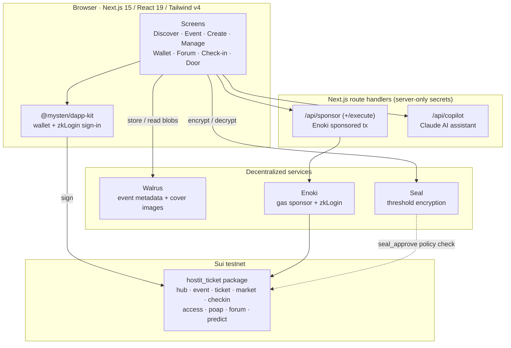
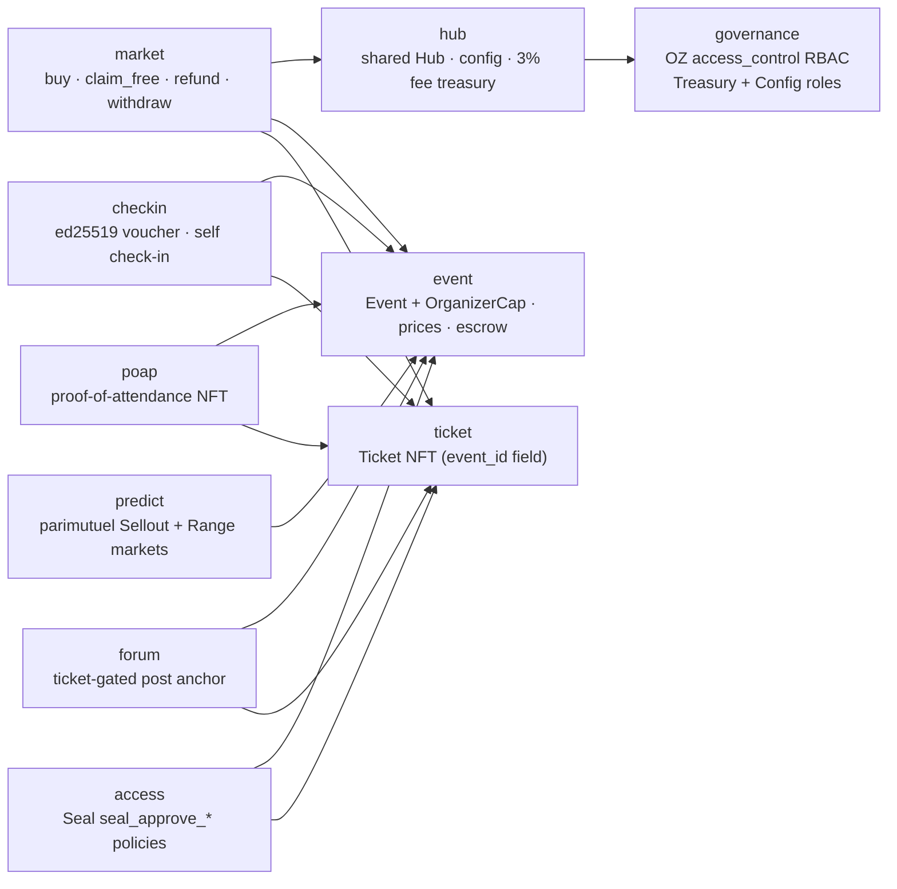
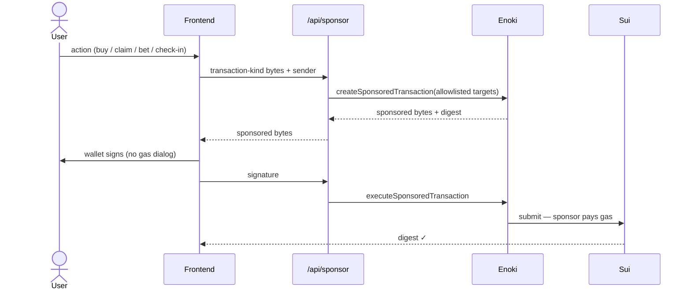
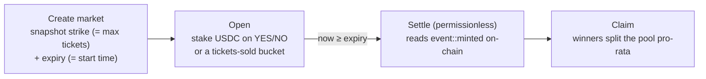

# HostIt — events made easy, on Sui

A **permissionless** event-ticketing platform on [Sui](https://sui.io). Anyone can host an event, sell tickets, check attendees in at the door, mint proof-of-attendance, run a ticket-gated chat, and open prediction markets on whether the event sells out — all on-chain, with **gasless UX**.

HostIt is a faithful Sui Move port of the HostIt EVM Diamond, paired with a Next.js dApp. It uses **Walrus** for event media, **Seal** for encrypted data, and **Enoki** for sponsored transactions and social login.

> **Status:** live on **Sui testnet**. Move package `hostit_ticket`, version 1 (`0x7816f65c…cefcd314c`). See [On-chain deployment](#on-chain-deployment).

---

## Features

- **Events & tickets** — permissionless `create_event`; one shared `Event` per event, generic `Coin<T>` payments, a 3% protocol fee, refunds, organizer payouts.
- **Check-in** — at the door a staff device scans the ticket and signs an **ed25519 voucher** that gates an attendee-submitted on-chain check-in; optional self check-in within the event window. Multi-day attendance supported.
- **POAP** — checked-in holders mint a proof-of-attendance NFT (once per ticket).
- **Ticket-gated forum** — encrypted, on-chain-anchored event chat (Walrus + Seal), readable only by ticket holders.
- **Prediction markets** — native parimutuel "Sellout Clock" (binary) and "final tickets-sold" (range) markets that **settle trustlessly on-chain** by reading the event's mint counter.
- **Gasless** — transactions are sponsored server-side via Enoki; sign-in via wallet or Google (zkLogin).
- **Trust signals, not gatekeeping** — suiNS names + verification badges, consistent with the permissionless design.

---

## Architecture



### On-chain modules

A single Move package, `hostit_ticket`, with hybrid access control: **per-event** admin is a capability (`OrganizerCap{event_id}`), while **protocol-level** governance uses OpenZeppelin's `access_control` RBAC (`governance` module). Millisecond timestamps throughout.



| Module | Responsibility |
|---|---|
| `hub` | Shared `Hub`: protocol config + 3% platform-fee treasury. Touched by every paid sale. Treasury/config entry fns are gated on `governance` roles. |
| `governance` | Protocol RBAC via OpenZeppelin `access_control`: shared `AccessControl<GOVERNANCE>` with `TreasuryRole` (fee withdrawal) + `ConfigAdminRole` (param tuning), plus a timelocked root-admin handoff. Replaces the single `PlatformCap`. |
| `event` | `create_event` shares one `Event` per event and mints an `OrganizerCap{event_id}`; holds per-coin price + escrow via dynamic fields. |
| `ticket` | One global `Ticket` type with an `event_id` field (not a per-event type). |
| `market` | `buy` / `buy_with_sui` / `claim_free` / `refund` / `withdraw_event_balance`; splits the fee into Hub + event escrow. |
| `checkin` | Attendee-signed check-in gated by an ed25519 voucher over `event_id ‖ ticket_id ‖ expiry`; `self_check_in` fallback. |
| `access` | `seal_approve_ticket` / `seal_approve_organizer` / `seal_approve_self` decryption policies. |
| `poap` | Proof-of-attendance NFT via a shared registry, claimable after check-in (one per ticket). |
| `forum` | On-chain anchor (`PostCreated`) for ticket-gated Walrus + Seal messages. |
| `predict` | Native parimutuel markets settling on `event::minted()`. |

### Gasless transaction flow

Sponsorship is **server-side** (the private Enoki key never reaches the browser); the user signs but pays no gas.



### Prediction markets

DeepBook Predict has no self-serve oracle on testnet, so HostIt ships its **own** parimutuel module that settles trustlessly against the event's verifiable on-chain mint counter — no oracle, no keeper, no fee.



---

## Tech stack

- **Move 2024** (`hostit_ticket`) on Sui · `sui` CLI for build/test/upgrade.
- **Next.js 15** (App Router) · **React 19** · **Tailwind v4**.
- `@mysten/sui` v2 · `@mysten/dapp-kit` v2 · `@mysten/enoki` · `@mysten/seal` · `@tanstack/react-query`.
- **Walrus** (HTTP publisher/aggregator) · **Seal** (committee key server) · **Enoki** (sponsored tx + zkLogin) · **Anthropic Claude** (in-app copilot).
- Package manager: **bun** (only).

---

## On-chain deployment

Live on **Sui testnet**. `web/lib/config.ts` is the source of truth (all values are env-overridable).

| Object | ID |
|---|---|
| Package (fresh v1 — original == latest; all calls + type origins) | `0x7816f65c8fb05298df91fe25065b82ada0f61d8020d5673376ad02ecefcd314c` |
| Shared `Hub` | `0x9468930839c11fdad73e739a4052d1fe9367bd8ea98dd3f7198bade074138514` |
| Shared `PoapRegistry` | `0x5f234a6fbf1a3cb46595f51a437b45328c3f574255b70fab70029a4c6eaa5001` |
| Shared `TransferPolicy<Ticket>` | `0xb6e6f12c669175ded687cbccb559ec32ac555229f832abd6cb13331d858a7c85` |
| Shared `AccessControl<GOVERNANCE>` (protocol RBAC) | `0xdda50d958747715c464a9d098d7b84fabb6037bcfd477b3909767659b25dfd27` |
| OZ `access_control` dependency (testnet, published-at) | `0xb357701a…390465d7` |
| Collateral coin (testnet USDC) | `0xa1ec7fc0…::usdc::USDC` |

> **Package versioning (Sui upgrades):** this is a **fresh publish (version 1)** — the predict `settle_after_ms` struct change was upgrade-incompatible, so the package was re-published rather than upgraded. With no upgrades yet, `PACKAGE_ID`, `PACKAGE_ID_LATEST`, `PREDICT_SELLOUT_PKG`, and `PREDICT_RANGE_PKG` are all the same id; a future in-place upgrade re-splits them (latest rolls forward, type origins stay pinned). See [`CLAUDE.md`](./CLAUDE.md) for the full model.
>
> **GH#51 (protocol RBAC) requires another fresh publish.** OpenZeppelin `access_control` mints its registry from a One-Time Witness in `init`, and `init` runs only at *first publish* — so RBAC cannot be added via `sui client upgrade`. On that gated deploy, the package id rolls forward, a shared `AccessControl<GOVERNANCE>` registry is created (deployer = default admin holding `TreasuryRole` + `ConfigAdminRole`), the old `PlatformCap` is gone, and `config.ts` + this table update. See [`DEPLOYING.md`](./DEPLOYING.md).

---

## Repository layout

```
hostit-sui/
├── Move.toml · Move.lock · Published.toml   # Sui Move package manifest + publish state
├── sources/                                 # Move modules: hub · governance · event · ticket · market
│                                            #               checkin · access · poap · forum · predict
├── tests/                                   # Move test_scenario suites
└── web/                                     # Next.js dApp
    ├── app/                                 # App Router routes (+ /api/sponsor, /api/copilot)
    ├── components/ (+ screens/)             # UI
    └── lib/                                 # config · ticketing · predict · hooks · walrus · seal · sponsor
```

---

## Local development

### Prerequisites
- [Bun](https://bun.sh) (never npm/pnpm)
- The [Sui CLI](https://docs.sui.io/guides/developer/getting-started/sui-install) (for Move build/test) on a testnet env

### 1 — Move package (run from the repo root)

```bash
sui move build          # compile
sui move test           # run all Move tests
sui move test predict   # run a subset by name
```

### 2 — Frontend (run from `web/`)

```bash
bun install
cp .env.local.example .env.local   # then fill in your keys (see below)
bun run dev                        # http://localhost:3000
bunx tsc --noEmit                  # typecheck (the primary verification gate)
bun run lint
bun run test                       # vitest unit tests
```

> ⚠️ Do **not** run `bun run build` while `bun run dev` is running — they share `.next/` and the prod build corrupts the dev bundle. Use `bunx tsc --noEmit` to verify instead.

### Environment

Copy `web/.env.local.example` → `web/.env.local`. Notable variables:

| Variable | Purpose |
|---|---|
| `NEXT_PUBLIC_ENOKI_API_KEY` | Public Enoki key — enables zkLogin sign-in (browser-safe). |
| `ENOKI_PRIVATE_API_KEY` | **Server-only** — used by `/api/sponsor` to sponsor gas. Never prefix with `NEXT_PUBLIC_`. |
| `NEXT_PUBLIC_GOOGLE_CLIENT_ID` / `GOOGLE_CLIENT_SECRET` | Google OAuth (secret is server-only). |
| `NEXT_PUBLIC_HOSTIT_*` / `NEXT_PUBLIC_USDC_COIN_TYPE` | Optional on-chain ID overrides; default to `lib/config.ts`. |

Without Enoki keys the app still runs — gasless UX is disabled and users pay their own gas. `.env.local` is git-ignored; the only env file in the repo is the all-blank `.env.local.example` template.

---

## Conventions

- **Permissionless:** no issuer/buyer role split — any wallet can host *and* hold. The UI signals quality via suiNS/verification, never access gates.
- **Deploys are gated upgrades:** shipping Move changes uses `sui client upgrade` (not fresh publish), which requires explicit per-deploy authorization.
- **Gasless allowlist** is server-authoritative in `web/app/api/sponsor/route.ts` (mirrored as a hint in `web/lib/sponsor.ts`).

For a deeper engineering guide, see [`CLAUDE.md`](./CLAUDE.md).

## License

MIT.
